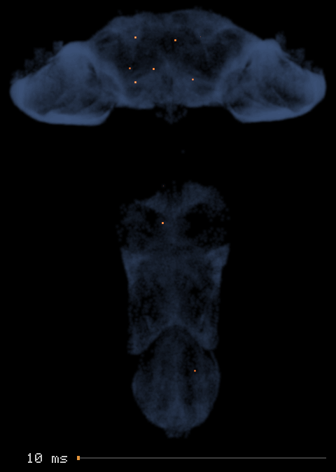
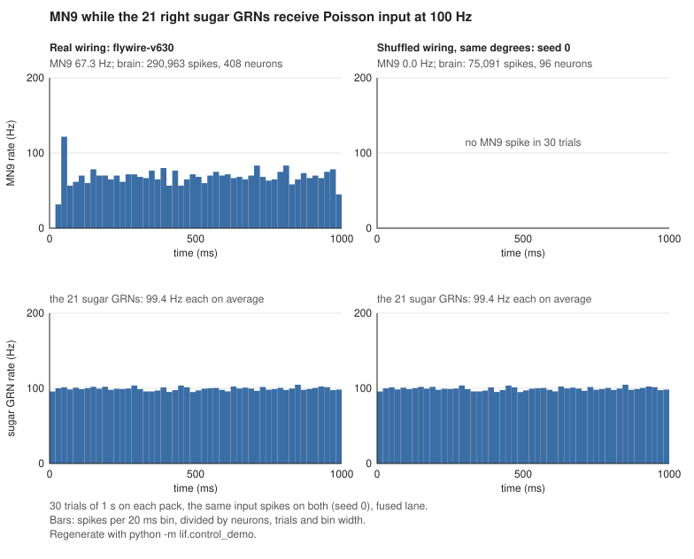

# drosophila-brain-mlx

<p align="center">
  
</p>

The published Shiu et al. leaky integrate-and-fire model — all 127,400 FlyWire
v630 neurons and 14,687,178 directed connections — runs at **0.29 seconds per
biological second** on an M4 Pro, where the same model in Brian2 takes **2.07 s**
on the same machine.

```bash
uv venv --python 3.13 && uv pip install -e .
./tools/fetch_upstream.sh          # ~90 MB from philshiu/Drosophila_brain_model
python -m lif.compile_pack         # builds data/pack/v630, ~114 MB
```

Same model, same parameters, same tick ordering. Only faster. The film above is a
different dataset — one second of sweet-taste input on MaleCNS v1.0, every dot a
neuron at its soma position — and what it does and does not show is under
[Where the activity goes](#where-the-activity-goes).

`./tools/demo.sh` redraws that film from a bare checkout: it fetches the MaleCNS
tables, compiles the pack and draws the picture, skipping whatever is already
done. Measured 2026-09-15: **29 s** once the data is in place, while a first run
adds **86 s** for the compile and however long ~1.1 GB takes to download.

## What this is

The [published model](https://www.biorxiv.org/content/10.1101/2023.05.02.539144v1)
is a Brian2 program. Brian2 is a fine simulator, and a one-second run of the full
brain costs about two seconds there, so a standard 30-trial experiment runs over
a minute and a sweep of them rather longer. This repository is the same model
reimplemented so that a second of brain time costs a third of a second of wall
clock.

Nothing here is trained or learned. The 14.7 million connections come from
FlyWire — real fly brains, sectioned, imaged under an electron microscope, every
one of them traced. The engine integrates membrane voltage through that fixed wiring.

## Does the wiring matter?

<p align="center">
  
</p>

The 21 right sugar-sensing neurons get Poisson input at 100 Hz, as in the
published model's example notebook, and the top row shows MN9, the proboscis motor
neuron that notebook reads out, over 30 trials of one second. On the FlyWire
wiring MN9 fires at 67.30 Hz. On a copy of the connectome in which every neuron
keeps its number of incoming and outgoing connections and the signs and sizes of
its outgoing synapses, but each connection goes to a random target, MN9 fires no
spike at all, and 96 neurons fire at all against 408 on the real wiring. Both
runs get the same input spikes, and the bottom row shows them arriving: the 21
sugar neurons fire at 99.40 Hz each on average on the real wiring and at 99.38 Hz
on the shuffled one. The plot shows shuffle seed 0; four more
shuffles (seeds 1 to 4) leave MN9 silent as well, with 89 to 99 neurons firing
at all. In these runs it is the wiring, not the degrees or the signs, that
carries the sugar signal to MN9. Every bar is counted from recorded spikes, and
these two commands rebuild the shuffled pack and the plot; `--seed N` and
`--shuffled data/pack/v630-shuffled-seedN --out other.svg` run another shuffle:

```bash
python -m lif.shuffle_pack --pack data/pack/v630 --seed 0
python -m lif.control_demo
```

## Where the activity goes

The film at the top of this page is this run.
MaleCNS v1.0 covers the brain and the ventral nerve cord, and its annotation table
gives most neurons a soma position, so a run on that pack can be watched in space.
Here the 17 neurons of the types LB3b and LB3c in the right labellum get Poisson
input at 100 Hz for 30 trials of one second. Tastekin et al.
([2025](https://www.biorxiv.org/content/10.1101/2025.08.25.671814v1)) match both
types to Gr64f-GAL4 neurons, which makes them likely sweet-sensing. Each frame is
10 ms of biological time, played eight times slower, while the view turns once
about the long axis of the CNS. An orange dot is a neuron at its soma position,
lit by how often it spiked in those 10 ms over the 30 trials; the blue haze is the
139,662 of 166,700 neurons that have a soma position.

Measured with `python -m lif.activity_film`, seed 0: 1,036,265 spikes from 5,021
neurons, 4,957 of them drawn; the other 64, the 17 driven neurons among them, have
no soma position in the table. MN9_L fires at 52.97 Hz and MN9_R at 0.20 Hz.
Counted by `python -m lif.stimulus_survey` on the same trials, neurons of the
ventral nerve cord's superclasses (`vnc_*`) fire 28.6 % of the spikes in the first
100 ms and 66.9 % in the last, while all spikes per trial in 100 ms go from 1,629
to 4,137.

This is a visualization, not evidence. The spike times come from the model and the
positions from the annotation table; the projection, colours, haze and slow motion
are choices for drawing them. The model's constants are Shiu et al.'s, fitted to
the FlyWire brain and not refitted to this connectome, which adds the ventral nerve
cord, so the film cannot say whether a fly's nervous system spreads activity this
way.

What the film does show is a property of this model on this connectome, and not
one that every stimulus brings out. `python -m lif.stimulus_survey` runs the film's
stimulus and seven others at 100 Hz, 30 trials each, and counts the spikes in every
100 ms:

| stimulus | neurons | VNC's share of the spikes, first → last 100 ms | abdominal neurons above 100 Hz in the last 100 ms |
|---|---|---|---|
| LB3b_R and LB3c_R, the film's | 17 | 28.6 → 66.9 % | 69 |
| LB3a_R, water taste | 8 | 41.2 → 48.4 % | 0 |
| ORN_DM1_R, smell | 39 | 4.4 → 5.0 % | 2 |
| JO-CM_R, Johnston's organ | 14 | 30.1 → 38.6 % | 12 |
| LC4_R, vision | 55 | 42.3 → 43.9 % | 0 |
| DNp01, the giant fibers | 2 | 47.1 → 57.3 % | 0 |
| LgLG1a_R, taste neurons of the VNC | 68 | 53.3 → 49.5 % | 10 |
| SNpp50, proprioceptors of the VNC | 62 | 88.6 → 89.0 % | 0 |

The film's rise lives in the abdominal neuromeres, where 69 of the 85 neurons above
100 Hz at its end sit, 55 of them in A7 to A10. With the outgoing synapses of all
2,156 abdominal VNC neurons silenced, the VNC's share stays between 25.1 and 29.9 %.
Once the state is reached a trial holds it without the input, but not every trial
reaches it, and every figure above is a mean over the 30. Counted trial by trial in
the last 100 ms: with the input on throughout, all 30 trials end between 2,440 and
3,345 VNC spikes; switched off after 500 ms, 25 of them do, between 2,518 and
3,514, while four fall to 477 to 877 and one falls silent; switched off after
200 ms, only 10 keep going, between 2,618 and 3,342, while 16 hold between 273 and
878 and four fall silent. The brain does not hold: in the 500 ms run its spikes
fall from 853 to 189 per trial per 100 ms. Pooled over the 30 trials that same
200 ms run reads instead as a steady 1,209 to 1,296 VNC spikes with no neuron above
100 Hz, which is a mean of trials that settled differently and not a description of
any of them. The smell stimulus has an effect of its own in the brain, where 1,170
neurons end above 100 Hz.

```bash
python -m lif.activity_film
```

## What this is not

- **Not a new model.** The equations, constants and connectivity are Shiu et al.'s.
- **Not a body simulation.** For an embodied fly with learned control, see
  [TuragaLab/flybody](https://github.com/TuragaLab/flybody) — a different project
  with a different goal.
- **Not portable.** Apple silicon only; it depends on Metal.

## Results

M4 Pro, 24 GB. FlyWire v630, 127,400 neurons, 14,687,178 edges, 10,000 ticks
(1 biological second at dt = 0.1 ms), 21 right sugar GRNs driven at 150 Hz,
`edge_split` 1 for the fused lane and 2 for the sparse Metal lane (see [Use](#use)).
Pack loading and one-time shader compilation excluded.

All rows marked *same session* were measured on 2026-09-14 within minutes of
each other, including the flyBrain comparison. That matters more than it sounds;
see "How much to trust these".

| Engine | s / biological s | Peak memory | |
|---|---|---|---|
| **this, fused — 2 Metal dispatches** | **0.2933** (±0.0001, n=3) | 665 MB | same session |
| [flyBrain](https://github.com/mehrantsi/flyBrain) Rust/Metal | 0.3769 (±0.0107, n=5) | 94 MB | same session |
| this, sparse Metal kernel | 0.7491 (±0.0182, n=3) | 265 MB | same session |
| this, dense MLX (chunked) | 19.55 (±0.518, n=3) | 834 MB | same session |
| this, dense MLX (eval per tick) | 22.02 (±0.356, n=3) | 326 MB | same session |
| **Brian2 2.10.1, cython (the published model)** | **2.07** (n=3 processes) | 3,140 MB | 2026-09-15 |
| Brian2 2.10.1, numpy | 8.38 | 3,158 MB | 2026-09-15 |

Reproduce the rows for this repository with:

```bash
python -m lif.benchmark --repeat 3
```

It checks every lane against the naive baseline before reporting a time, so a
lane that lost parity is marked FAIL rather than being credited with a number.
All four produce a bit-identical spike-count SHA-256.

Read the comparisons carefully:

- **vs. Brian2 (~7×)** is the number that matters. Same model, same machine, both
  over a full biological second. This replaces a **~213×** published here until
  2026-09-15, which was wrong. That figure came from a Brian2 time extrapolated
  from a 200-tick run, and `net.run` carries a fixed cost that does not shrink
  with the run: divided by 0.02 biological s it is inflated about thirtyfold.
  Measured with the same script, Brian2 gives 7.9 s per biological second at 200
  ticks, 2.5 at 2,000 and 2.07 at 10,000. The old text also called it a lower
  bound on the grounds that the network was barely active; that is backwards, as
  the short run overstated the cost rather than understating it.

  Brian2's code generation target matters as much as the duration: 2.07 s with
  cython, 8.38 s with numpy, so ~7× or ~29× depending on whether a compiler is
  available, and a Brian2 figure quoted without its target is not reproducible.
  Both were measured with `python tools/bench_brian2.py --ticks 10000`, which
  runs upstream's own `model.py` on the same 21 sugar GRNs at 150 Hz and times
  `net.run` alone; three fresh processes agreed within 0.01 s, and Brian2's
  13,448 to 14,239 spikes match this engine's 13,594 on the same drive, so the
  two are doing the same work. The comparison is still not quite fair to Brian2:
  it records every spike time in a `SpikeMonitor` while these lanes are timed
  without recording. Measured on 2026-09-15, recording on and off interleaved
  over seven repetitions, that costs the fused lane **+12.3 %**, 0.2949 against
  0.3313 s per biological second — and the record-off figure landing 0.4 % from
  the benchmark's 0.2937 is what makes the pair worth quoting. Against 0.3313 the
  margin is **6.2×**.
- **vs. flyBrain (~22 %)** is a narrow win over a small, young project, and it
  costs 7× the memory, most of it work that `async_eval` has scheduled and not
  yet finished: with a blocking `eval` the same run peaks at 273 MB (see
  [Use](#use)). Their engine also processes more spikes in this run
  because its refractory semantics differ (see below); at equal spike counts the
  margin is smaller, and under CPU load it falls to ~10 % (below). Two further
  rows, for flyBrain's own MLX lanes at 3.241 and 40.62, were dropped from the
  table on 2026-09-15: they came from an earlier session and were never
  re-measured, and after the Brian2 figure turned out to be wrong for exactly
  that reason, an unverified number is not worth the space it takes.

  The flyBrain row itself was re-measured on 2026-09-15 and held. At 20260816,
  the seed `lif.benchmark` runs, five runs averaged 0.3781 s per biological
  second against the 0.3769 above and allocated the same 94 MB, so the margin
  against this engine's 0.2937 from the same day is 22.3 %; at seed 0 the same
  five-run average is 0.3771, so the timing hardly notices the seed. flyBrain's
  own output names what it ran — `right_sugar_grns`, `splitmix64-counter-v1`, 21
  targets at 150 Hz over 10,000 steps — and its spike-count SHA-256 was identical
  across the runs at a given seed. At 20260816 it fires 16,796 spikes against
  this engine's 13,594, and that 16,796 is the figure recorded under "One open
  discrepancy" below, measured again here: the gap is the refractory difference,
  not noise. `tools/setup_flybrain_reference.sh` prints the command.

### How much to trust these

Two things were found on 2026-09-14 while re-measuring. Both are recorded
because a benchmark nobody can falsify is not a benchmark.

**The sparse Metal lane was mistuned, and the table overstated what fusion
bought.** That lane ran at `EDGE_SPLIT = 16`, this module's old default, which
is fastest in none of the six lane and drive combinations swept under [Use](#use).
At the correct `K = 2` it is 2.0× faster than previously
published: 1.5163 → 0.7491. The fused lane was already at its optimum and did
not move. But the fusion step was being credited against that bad baseline, so
its gain drops from a published 5.2× to a measured **2.55×**. The fastest
number in this repository is unchanged; the story of how it was reached is not.

**Wall-clock here is partly host-bound, and flyBrain's is not.** The same
measurement on a machine under CPU load (load average 2.8, an Electron app at
~57 % of a core) moves the two engines very differently:

| | idle-ish | under load | |
|---|---|---|---|
| this, fused | 0.2933 | 0.3341 | +13.9 % |
| flyBrain Rust/Metal | 0.3769 | 0.3726 | −1.1 %, i.e. noise |

The GPU work is identical in both cases; the spike-count SHA-256 never changes.
The difference is that this engine rebuilds its MLX graph on the host every
chunk, and that host work competes for CPU, while a native Rust loop does not.

This lane is faster than flyBrain in **both** states measured, but by very
different amounts: **22 % on a quiet machine, 10 % under the load above.** Two
points is not a curve, so no claim is made about where it ends up on a busier
host than was tested. If you benchmark this yourself and get a worse number than
the table, check your CPU load before suspecting your build.

## Datasets

Two connectome packs are supported. They are different animals from different
laboratories; **spike counts are not comparable across them**, and the Shiu et
al. constants were fitted to FlyWire only.

| | FlyWire v630 | MaleCNS v1.0 |
|---|---|---|
| specimen | female, brain only | male, brain **and** ventral nerve cord |
| neurons | 127,400 | 166,700 |
| edges | 14,687,178 | 24,469,412 |
| leg / wing motor neurons | absent | 708 VNC + 107 brain |
| licence | non-commercial | CC BY 4.0 |

MaleCNS, 2,000 ticks, 100 top-out-degree hubs at 150 Hz, `K = 8` for both kernel
lanes, all four parity-gated against the naive baseline. Measured 2026-09-14,
best of 3 runs, load average 1.79 before and 1.33 after; written to
`bench/results_malecns.json` by the MaleCNS command under [Install](#install):

| Engine | s / biological s | Peak memory |
|---|---|---|
| **this, fused — 2 Metal dispatches** | **1.1676** (±0.0010, n=3) | 434 MB |
| this, sparse Metal kernel | 1.7055 (±0.0013, n=3) | 412 MB |
| this, dense MLX (chunked) | 31.86 (±0.015, n=3) | 1204 MB |
| this, dense MLX (eval per tick) | 34.21 (±0.024, n=3) | 434 MB |

Re-measured on 2026-09-15 with the same command, load average 1.86 before and
1.72 after: 1.1691, 1.7135, 31.80 and 34.13 s per biological second, all four
still parity PASS and every peak within 1 MB of the row above. The largest
difference is 0.5 %, on the sparse Metal lane, so these rows stand as measured;
they are kept rather than replaced because they are one coherent set.

The surviving edge count, 24,469,412, is the same figure flyBrain publishes for
the same published materialization, reached through an independently written
filter. That agreement is the strongest evidence available that the selection
rules are right.

## Install

Requires macOS on Apple silicon and Python ≥ 3.11.

```bash
uv venv --python 3.13 && uv pip install -e '.[dev]'   # [dev] is pytest, for the gates below
./tools/fetch_upstream.sh          # ~90 MB from philshiu/Drosophila_brain_model
python -m lif.compile_pack         # builds data/pack/v630, ~114 MB
```

A second dataset is supported: MaleCNS v1.0, a male specimen covering brain
**and** ventral nerve cord, 166,700 neurons, so it contains the leg and wing
motor neurons the FlyWire brain-only pack does not. Optional and much larger to
fetch:

```bash
./tools/fetch_male_cns.sh          # ~1.06 GB, CC BY 4.0
python -m lif.compile_pack_malecns # builds data/pack/male_cns_v1
python -m lif.benchmark --quick --repeat 3 --pack data/pack/male_cns_v1 --out bench/results_malecns.json
```

`./tools/demo.sh` runs the first two of those and then draws the activity film,
skipping any step already done and printing what each one cost. Measured
2026-09-15 on an M4 Pro: 2 s to check the three cached files, 0 s for the compile
when the pack is there and 86 s when it is not, and 27 s to run 30 trials and
encode the film — 29 s in all with the data in place. It rewrites
`docs/figures/activity-film.png` with the same bytes the repository ships
(sha256 `beb947e2…`), so the checked-in figure can be re-derived rather than
trusted.

Spike counts from the two packs are not comparable: different specimen,
different laboratory, and the Shiu et al. constants were fitted to FlyWire.

Both compilers run their validation checks and refuse to write anything if one
fails. `python -m lif.verify_pack [--pack <dir>]` audits the result
independently afterwards, through a different code path so a bug cannot confirm
itself; it re-derives the MaleCNS node selection and transmitter signs from the
raw tables rather than importing them.

```bash
pytest                      # parity and determinism gates
python -m lif.benchmark     # the table above
```

## Use

```python
from lif import core, engine_fused

pack = core.load_pack()
# the hub drive: the 100 highest out-degree neurons at 150 Hz
stim = core.make_stimulus(pack, n_ticks=10_000, seed=20260913)
result = engine_fused.run(pack, stim, chunk=32, edge_split=8)

print(result.total_spikes(), result.counts_sha256())
```

`edge_split` is the one knob that matters. It sets how many GPU threads share one
neuron's edge list. There are that many threads for every neuron in every tick,
and nearly all of them exit at once because their neuron did not fire, so a
larger value helps when the neurons that do fire carry long edge lists and costs
when they do not. The best value follows the drive, and on a sparse drive also
the lane:

- **Sparse drive**, such as the 21 sugar GRNs (FlyWire: 1.36 spikes per tick in
  the whole network, with 209 outgoing edges): **1** for the fused lane, **2**
  for the sparse Metal lane, where 1 measured within 0.1 %.
- **Hub drive**, which is what `make_stimulus` produces (FlyWire: 3.93 spikes
  and 6,534 outgoing edges per tick; MaleCNS: 3.69 and 7,346): **8** for both
  lanes, the default.

Measured end to end on 2026-09-14, M4 Pro, one process per pack with the runs
interleaved, median of 7, load average 2.47 to 3.05. Bold is the fastest value
in s per biological second, every other cell the time relative to it:

| pack, drive, ticks | lane | K=1 | K=2 | K=4 | K=8 | K=16 |
|---|---|---|---|---|---|---|
| FlyWire, 21 sugar GRNs, 10,000 | fused | **0.301** | 1.16× | 1.52× | 2.29× | 3.80× |
| | sparse Metal | 1.00× | **0.746** | 1.12× | 1.42× | 2.06× |
| FlyWire, 100 hubs, 2,000 | fused | 2.23× | 1.42× | 1.07× | **1.140** | 1.21× |
| | sparse Metal | 1.89× | 1.31× | 1.06× | **1.623** | 1.14× |
| MaleCNS, 100 hubs, 2,000 | fused | 2.52× | 1.58× | 1.14× | **1.168** | 1.32× |
| | sparse Metal | 2.09× | 1.45× | 1.12× | **1.710** | 1.18× |

The other drive's value costs 2.23× to 2.52× in the fused lane and 1.31× to
1.45× in the sparse Metal lane; 16 is fastest in no row. The engine cannot pick
the value at runtime without reading the spike count back to the host, which is
exactly the synchronisation the design avoids.

To silence neurons, pass a boolean mask over the pack's neuron indices:

```python
import numpy as np

index = {int(n): i for i, n in enumerate(pack.neuron_ids)}
silenced = np.zeros(pack.n_neurons, dtype=bool)
silenced[index[720575940624963786]] = True
result = engine_fused.run(pack, stim, silenced=silenced, chunk=32, edge_split=8)
```

Silencing sets every synapse *from* a neuron to zero weight, which is what
`silence` in the published model's code does. That repository's README says
"to and from"; its code produced the published results, and this follows the
code. A silenced neuron still integrates, spikes and counts, and may also be
driven.

To drive chosen neurons instead of the hubs, pass their indices and a rate:

```python
from lif import stimulus_flybrain

sugar = stimulus_flybrain.targets(pack.neuron_ids)   # indices of the 21 sugar GRNs
stim_sugar = core.make_stimulus_for(pack, sugar, 150.0, n_ticks=10_000, seed=20260913)
result = engine_fused.run(pack, stim_sugar, chunk=32, edge_split=1)
```

`targets2=` and `rate2_hz=` add a second set at another rate, as `neu_exc2` and
`r_poi2` do in the published model. As there, no driven neuron is ever
refractory, including those of a second set at 0 Hz: that set receives no input
and still changes the run once one of its neurons fires. A neuron listed twice,
or in both sets, raises.

To record which neuron fired in which tick, pass `record=True`:

```python
from lif import spike_record

result = engine_fused.run(pack, stim, chunk=32, edge_split=8, record=True)
tick, neuron = result.events[:, 0], result.events[:, 1]   # int32, sorted by tick
seconds = spike_record.tick_to_seconds(tick)              # tick k is k * 0.1 ms
```

The kernel lanes extract the events on the GPU, once per chunk, into a buffer of
`cap` events (default 262,144 per chunk). A chunk that produces more raises
`RecordOverflow` naming its ticks rather than dropping spikes.

To run an experiment as the published model's `run_exp` does, with its arguments
and its parquet file:

```python
from lif.experiment import default_params as params, rates, run_exp

neu_sugar = list(stimulus_flybrain.RIGHT_SUGAR_GRN_IDS)
path = run_exp("sugarR", neu_sugar, "results", params=params)   # 30 trials of 1 s
table = rates(path)   # flywire_id, name, rate_hz, std_hz per neuron that fired
```

Upstream's `load_exps` and `get_rate` read the file unchanged. `params` is
upstream's `default_params` in plain seconds, volts and hertz, and a Brian2
quantity may replace any value, so `params['r_poi'] = 100 * Hz` works as in
upstream's example notebook. That notebook runs on `run_exp` with its code cells
unchanged, and its results agree with the Brian2 files upstream published for
it ([Correctness](#correctness)). Only `t_run`, `n_run`, `r_poi` and `r_poi2` can
change; the model constants are compiled in. Trial `n` draws its input with
`seed + n`, so experiments with the same seed and `neu_exc` share their input
spike trains. 30 trials of 1 s with the sugar drive take 10.05 s end to end —
measured 2026-09-14 in High Power mode, three repetitions of 10.21, 10.05 and
10.05 s, the first including kernel compilation, each writing 409,437 spikes —
against about 77 s extrapolated for Brian2 on one core, which rebuilds the
network for every trial.

On the MaleCNS pack, names need no dict. `python -m lif.compile_pack_malecns`
writes the annotation table's `type`, `instance`, `class` and `flywireType` next
to the pack (`--names-only` adds them to a pack already compiled), and `run_exp`
looks a name up there when no `names` are given. A name selects every neuron
whose instance it is or, if there is none, every neuron whose type it is, so
`"MN9_R"` is one neuron and `"MN9"` both; the file's metadata lists the IDs that
ran. On the FlyWire pack, which ships no names, pass `names=` as upstream does.

```python
from lif import core, names

malecns = core.load_pack(core.PACK_DIR.parent / "male_cns_v1")
path = run_exp("mn9", ["MN9"], "results", params=params, pack=malecns)
table = rates(path, names=names.load(malecns).labels())   # instance, else type
```

What recording costs in the fused lane, measured 2026-09-14 in High Power mode,
recording on and off interleaved in one process per pack, median of 7, load
average 2.75 to 3.28. That load slows the fused lane (see "How much to trust
these"), so compare within a row, not with the table at the top:

| pack, drive, ticks | s / biological s | with `record=True` | overhead | peak memory |
|---|---|---|---|---|
| FlyWire, 21 sugar GRNs, 10,000, `edge_split` 1 | 0.3361 | 0.3821 | +13.7 % | 669 → 380 MB |
| FlyWire, 100 hubs, 2,000, `edge_split` 8 | 1.2355 | 1.2882 | +4.3 % | 685 → 380 MB |
| MaleCNS, 100 hubs, 2,000, `edge_split` 8 | 1.3624 | 1.4142 | +3.8 % | 434 → 435 MB |

The sugar row was re-measured on an idle machine on 2026-09-15, the same way and
also a median of 7: 0.2949 without recording against 0.3313 with it, **+12.3 %**.
That is the figure the Brian2 comparison uses, because it and the 0.2937 it sits
next to come from the same session; the +13.7 % above was measured under the load
described, which raises both halves of the row.

The added time is nearly the same in every row, 0.046 to 0.053 s per biological
second or 0.15 to 0.17 ms per 32-tick chunk, although the hub drives fire 2.7 to
2.9 times as many spikes per tick as the sugar drive. It is a cost per chunk
(stacking the chunk's spike masks, one dispatch, reading the events back), not
per spike, so it weighs most where a tick is cheapest. The lower FlyWire peak is
a side effect: a recording lane waits for the previous chunk before it encodes
the next, so less scheduled work is in flight at once. With a blocking `eval`
instead of `async_eval`, the same sugar run peaks at 273 MB without recording and
283 MB with it; on MaleCNS all four combinations peak within 12 MB of each other.

Measured with 10 silenced neurons that never fire, against the same run without
a mask, the fused lane moved −1.16 % on FlyWire with the sugar drive and +0.01 %
on MaleCNS with the hub drive. The mask empties those neurons' edge ranges for
the run rather than being tested in the kernel's early exit, which cost +36 % on
MaleCNS at `edge_split` 8 (see "Things that did not work", and the measured table
in `src/lif/engine_metal.py`).

## Correctness

Speed claims are worthless without a correctness gate, so there are three.

**Between lanes.** All four engines must produce identical per-neuron spike
counts from the same stimulus and seed, compared by SHA-256 over the full
127,400-element vector. They do, and final `v`/`g` match bitwise. The same holds
with a silencing mask, which the kernel lanes implement as empty edge ranges and
the dense lanes as zeroed edge counts, so that gate compares two unrelated
mechanisms. With recording on, the sorted spike events are identical too, and
there the naive lane's `np.nonzero` on the host checks the kernel lanes' event
extraction on the GPU.

**Against Brian2.** `src/lif/validate_brian2.py` runs Brian2 2.10.1 and this
engine on a connected 800-neuron subnetwork with a fixed spike train, so no RNG
difference can contaminate the comparison. `src/lif/engine_ref64.py` is a float64
NumPy oracle with the same tick semantics — necessary because Metal has no
float64, so without it "wrong semantics" cannot be told apart from "float32
rounding".

| Configuration | Brian2 spikes | ref64 (f64) counts | ref64 spike times | MLX (f32) counts | MLX spike times |
|---|---|---|---|---|---|
| 4 seeds @ 150 Hz, 500 ticks | 38 | 38 ✅ | identical ✅ | 38 ✅ | identical ✅ |
| 20 seeds @ 400 Hz, 2,000 ticks | 2,973 | 2,973 ✅ | identical ✅ | 2,974 | 23 missing, 24 extra |
| 40 seeds @ 800 Hz, 2,000 ticks | 9,035 | 9,035 ✅ | identical ✅ | 9,035 ✅ | 28 missing, 28 extra |
| 60 seeds @ 1,200 Hz, 3,000 ticks | 24,700 | 24,700 ✅ | identical ✅ | 24,700 ✅ | 38 missing, 38 extra |

The float64 oracle matches Brian2 exactly in every configuration, spike by spike:
every `(neuron, time)` pair Brian2's `SpikeMonitor` records, with engine tick `k`
at time `k * dt` and no offset. The float32 lane matches the per-neuron counts in
three configurations and differs by one spike in 2,973 in the fourth, but its
spike times differ in all but the shortest: a spike moved to another tick counts
the same. The first difference comes after 18 to 35 ms of simulated time, and
most moved spikes fire one tick early. All four MLX lanes record identical
events, so this is float32 rounding at the strict threshold, unavoidable
without float64 on the GPU. Measured 2026-09-14, one row per run of
`python -m lif.validate_brian2 <ticks> <seeds> <rate_hz>`, which exits non-zero
if ref64 differs from Brian2 at all or if the fused lane leaves out or adds more
than 5 % of Brian2's spikes.

**Against the published notebook.** The Brian2 gate runs 800 neurons on a fixed
spike train. Upstream also publishes the files its Brian2 `run_exp` wrote for
five experiments of its example notebook, on the whole v630 brain with Poisson
input, and `python -m lif.validate_notebook` checks this engine against them. It
first runs the notebook's code cells as they are, with `model` resolving to
`lif.experiment`: eleven of its twelve run, only the Colab setup cell with its
shell commands is left out, and every file the notebook writes comes from this
engine's fused lane. Then it runs the five experiments again with seeds 0 and
1000. Brian2's random input is not this engine's, so the files can agree only in
distribution. Each neuron's rate over the 30 trials is compared as a z score,
the difference over its standard error, and the two seeds' runs are compared
with each other the same way, which shows how far apart two runs of the same
model fall.

| sugar GRNs, silenced | spikes per trial: Brian2 · seed 0 · seed 1000 | MN9 (Hz): Brian2 · seed 0 · seed 1000 | neurons with \|z\| > 3: Brian2–seed 0 · Brian2–seed 1000 · seed 0–seed 1000 |
|---|---|---|---|
| 200 Hz, none | 17,052.2 · 17,027.8 · 17,052.5 | 93.27 · 94.23 · 92.73 | 0 of 461 · 3 of 463 · 4 of 463 |
| 100 Hz, none | 9,635.8 · 9,698.8 · 9,719.7 | 67.03 · 67.30 · 67.67 | 1 of 421 · 2 of 418 · 0 of 411 |
| 100 Hz, 720575940617937543 | 9,261.8 · 9,384.0 · 9,399.5 | 63.27 · 63.57 · 65.57 | 13 of 420 · 4 of 418 · 4 of 410 |
| 100 Hz, 720575940621754367 | 9,566.8 · 9,494.7 · 9,644.1 | 66.90 · 66.87 · 68.60 | 1 of 409 · 1 of 434 · 1 of 436 |
| 100 Hz, 720575940622695448 | 10,032.1 · 10,074.5 · 10,113.9 | 71.17 · 69.90 · 72.17 | 0 of 418 · 0 of 419 · 1 of 413 |

Between Brian2 and this engine, spikes per trial differ by at most z 1.90 and
MN9's rate by at most z 1.70. With 720575940617937543 silenced, the seed-0 run
differs from Brian2's file in 13 neurons but the seed-1000 run in 4, as many as
the two seeds' runs differ in, so that seed-0 run is the outlier. The command
exits non-zero if spikes per trial or MN9 differ by |z| 4 or more, or more than
1 % of the neurons by more than 4. That gate is for gross errors, and it catches
one: upstream's `sugarR` file, the first row, was written at 200 Hz, the default
the notebook's text gives, and its sugar GRNs fire at 196.75 Hz, while
`default_params` in `model.py`, and so here, now say 150 Hz. Against the 150 Hz
run the unchanged notebook makes, 354 of 455 neurons differ by more than |z| 4
and spikes per trial by z −45.85. Measured 2026-09-15; the command needs Brian2
and pandas, `pip install -e '.[reference]'`.

## How it works

Each tick preserves Brian2 ordering: exact closed-form update of `v` and `g` for
non-refractory neurons, strict `v > -45 mV` threshold, propagation of spikes
delayed by 1.8 ms through source-major CSR, application of signed synaptic counts
and external input, then reset, refractory update and delay-ring store.

Synaptic arrivals accumulate as `int32` contact counts and the 0.275 mV factor is
applied afterwards. Integer addition is associative and cannot overflow here, so
the result does not depend on thread completion order — deterministic, unlike
float atomics.

Two Metal dispatches per tick: one for propagation (atomics), one for everything
else. Getting from 22 s to 0.29 s was three findings, in order of size:

1. **Dense is the problem, not synchronisation.** Every tick touched all 14.7 M
   edges regardless of how few neurons fired — dense runtime is flat across a
   5,000× range in activity. Pure MLX cannot avoid this: compacting the spike
   list has a data-dependent output size, which the lazy graph cannot express.
   `mx.fast.metal_kernel` is the only way out, and it works by letting each
   thread exit early rather than by removing a sync. 19.6 s → 0.75 s, by far
   the largest step.
2. **Load imbalance.** Out-degree runs from 0 to 9,615 with a mean of 115, and
   the driven neurons are the biggest hubs. One thread per neuron serialises
   ~9,600 atomics while 127,399 idle.
3. **Intermediate materialisation.** Once propagation is sparse, the cost is the
   elementwise half: MLX writes every intermediate to memory, so a chain of ~16
   ops moves 15.6 MiB per tick through DRAM at 114 GiB/s while the values
   themselves fit in registers. Fusing the chain into one kernel moves 1.0 MiB
   and brought 0.75 s → 0.29 s.

   That gain was published as 5.2× (1.51 s → 0.29 s) until 2026-09-14. The
   1.51 s baseline was the sparse lane running at a mistuned `EDGE_SPLIT`;
   against a correctly tuned baseline the fusion is worth **2.55×**, not 5.2×.
   The isolated microbenchmark above still measures 5.9× because it fuses a pure
   16-op chain, whereas the engine's elementwise half is a smaller share of a
   tick that also does propagation.

   This was also written up as *dispatch overhead* until it was measured properly.
   It is not: 16 kernel dispatches inside one `mx.eval` cost what one costs
   (0.1117 ms vs 0.1121 ms). The ~0.11 ms floor is per `eval`, not per dispatch.
   A standalone microbenchmark of the same 16 ops gives 0.1333 ms/tick chained
   against 0.0225 ms fused, a 5.9x that matches the 5.2x seen in the engine.

## MLX notes

The transferable findings, with the measurements behind them, are in
[docs/mlx-notes.md](docs/mlx-notes.md): what to measure first, why fusing
elementwise chains is the largest single win, why `eval` and not the dispatch is
the unit of overhead, and the two limitations below in more detail.

## Two MLX limitations worth knowing

**`mx.compile` breaks bit-reproducibility.** It fuses elementwise ops into a
kernel where Metal contracts `a*b + c` into a fused multiply-add — mathematically
equivalent, differently rounded. With a strict threshold that eventually flips a
spike: invisible for 4,000 ticks, then 54,270 vs 52,472 spikes at 10,000. MLX
offers no switch to disable contraction, so `mx.compile` is unusable for any
model with a strict threshold decision if you need reproducibility. Inside a
hand-written kernel it *is* controllable — `#pragma clang fp contract(off)`.

**There is no accumulating scatter.** MLX 0.32.2 has no `bincount`,
`segment_sum`, `index_add` or public `scatter_add`, and `arr[idx] = vals` is
last-write-wins, not accumulation. `arr.at[idx].add()` and `mx.fast.metal_kernel`
are the only options.

## Credit where it is due: flyBrain

[`mehrantsi/flyBrain`](https://github.com/mehrantsi/flyBrain) (MIT) is a
Rust/Metal engine for the same model. Two of the three findings above came from
reading it, and it is only fair to say so plainly:

- **It got to `mx.fast.metal_kernel` first.** Its MLX lane already propagates CSR
  through a hand-written Metal kernel with one thread per source neuron and an
  early exit — the same shape as the kernel here. Its README's remark about
  per-tick host synchronisation is what prompted this project in the first place.
- **Kernel fusion came straight from its README**, which describes fusing
  decay/threshold work with CSR propagation to remove a full-neuron dispatch per
  tick. Applying that idea took this engine from 0.75 s to 0.29 s, a 2.55×
  that is the second-largest step here, and not my idea.
- Its benchmark setup (sugar-GRN stimulus, chunked steps, excluding pack load and
  shader compilation) is what made a fair comparison possible at all.

What this engine adds on top is the edge-split for load imbalance, which its
kernel does not do, and a stricter parity gate.

`tools/setup_flybrain_reference.sh` builds it locally so anyone can re-run the
comparison instead of taking the numbers on trust.

### One open discrepancy

Its README states that incoming conductance can accumulate while a neuron is
refractory, "matching the upstream Brian2 equations". As far as I can measure,
Brian2 2.10.1 with this model formulation does the opposite: `(unless
refractory)` shields the variable from *every* write, synaptic input included. A
spike arriving at a refractory neuron leaves its `g` at exactly `0.00000`, before
and after the refractory period ends — dropped, not queued.

This matters because it changes results. Measured on 2026-09-15 with the same
stimulus on both sides — the sugar drive at 150 Hz, seed 20260816, 10,000 ticks —
this engine fires **13,594** spikes as shipped and **16,382** with that one gate
removed, against flyBrain's **16,796**. Removing it closes 87 % of the gap,
from 3,202 spikes to 414, which is the strongest evidence available that this is
the difference. The remaining 414 stay unexplained, so there is likely a second
difference I have not found, and I may simply be wrong about how their engine
handles this — I have not read their kernel closely enough to claim otherwise.

Published here until that date: 13,354 moving to 17,315, with a residual of 819.
Those three figures match no run recorded in this repository — `bench/results.json`
has said 13,594 since the first commit — and 17,315 − 16,796 is 519 rather than
819 in any case. They are superseded by the measurement above.

Reproduce it with `python tools/refractory_gate.py`, which runs the dense lane
twice, once as shipped and once with the gate removed, and refuses to report the
second number unless the first reproduces `bench/results.json`. The engine is not
modified: the tick function is copied into that script with the single line
changed. The Brian2 side is `python -m lif.validate_brian2` and the two-neuron
case described in the source. Corrections welcome.

## Repository

```
src/lif/
  compile_pack.py          FlyWire CSV/parquet -> source-major CSR pack, 40 checks
  compile_pack_malecns.py  MaleCNS v1.0 tables -> the same pack format
  verify_pack.py           independent audit of a written pack
  shuffle_pack.py          a pack with random wiring and the same degrees, as a control
  control_demo.py          MN9 under the sugar drive on the real and the shuffled pack, as an SVG
  activity_film.py         a MaleCNS run's spikes at their soma positions, as an animated PNG
  stimulus_survey.py       MaleCNS spikes over a trial by region, for the film's and seven other stimuli
  core.py                  constants, pack loader, stimulus, initial state
  experiment.py            run_exp and rates, compatible with the published model
  names.py                 cell-type names of the MaleCNS pack, as run_exp resolves them
  stimulus_flybrain.py     flyBrain's splitmix64 sugar-GRN stimulus
  engine_naive.py          eval() per tick — the deliberately slow baseline
  engine_chunked.py        N ticks per eval, async_eval
  engine_metal.py          sparse CSR propagation via mx.fast.metal_kernel
  engine_fused.py          whole tick in two Metal dispatches — the fast lane
  engine_ref64.py          float64 correctness oracle, not a performance lane
  spike_record.py          spike events (tick, neuron), one Metal kernel per chunk
  subnet.py                connected subnetwork for Brian2 validation
  validate_brian2.py       Brian2 vs ref64 vs MLX, spike counts and spike times
  validate_notebook.py     upstream's example notebook on this engine, against its published files
  benchmark.py             reproduces the results tables
tests/                     parity, determinism and Brian2 spike-time gates, benchmark,
                           stimulus, pack-writing, pack-verification and argument-guard checks
bench/results*.json        measured numbers, written by the benchmark
tools/                     fetch scripts, demo.sh, the Brian2 and refractory-gate
                           measurements, flyBrain reference build
```

### Things that did not work

Recorded so nobody repeats them:

- **Two-kernel spike compaction.** Writing the firing neurons into a list with an
  atomic counter, then dispatching over `MAXS·K` threads instead of `N·K`, is the
  obvious next optimisation. It is slower: 0.0572 ms against 0.0550 ms for the
  single kernel. The second dispatch costs more than the smaller grid saves.
- **Testing the silencing mask in the kernel's early exit.**
  `if (!spike[i] || silenced[i]) return;` is one extra read, but all `N·K`
  threads run it, including the ones that exit: +36 % of the fused tick on
  MaleCNS at `edge_split` 8, +74.5 % at 16, nothing at 1. A nested `if` or a
  ternary costs the same. Silencing now empties the neuron's edge range, which
  only threads whose neuron spiked read.
- **Trusting `StateMonitor` timestamps.** Brian2 records with `when='start'`,
  so monitor row `t` holds the state at the *end of tick t-1*. Read as same-tick
  state it fakes a one-tick lag, which cost me two "fixes" to the refractory and
  delay constants before I caught it. Compare monitor row `t+1` against engine
  tick `t`. The correct values are the plain quotients: 22 and 18 ticks.

## What is deliberately not here

The engine is the simulation half of the published model, and
`lif.experiment.run_exp` the experiment half (activate a set of neurons, silence
another, 30 trials, rates), with the same signature and parquet output as the
original, so its example notebook runs with its code cells unchanged. That is the
whole of it. What was considered and left out, so it is not re-argued:

- **Model-constant sweeps** (`v_th`, `tau`, ...). The constants are fixed at
  compile time so the closed-form coefficients stay bit-identical to Brian2's.
  Making them per-run parameters is possible; nobody has asked.
- **Full-raster output** (every neuron, every 0.1 ms, dense). 152 MB per trial
  for a 0.001 % occupancy. Events cover every use we know of.
- **Portability.** Metal only. That is the point of the repository.
- **Training or plasticity.** Nothing here learns.
- **A native rate-first API** (`Experiment(excite=..., silence=..., trials=30)`),
  which would have been tidier than upstream's signature and is what was
  originally recommended. Rejected because a researcher's existing notebook
  running unchanged is worth more than a nicer signature.
- **A per-tick output port for a body.** Upstream computes rates as
  `len(spikes in trial) / t_run`, counts only, so `spike_counts` already covers
  the case. Coupling to flybody, FlyGym or flyBrain's MuJoCo scene would need
  that port and a realtime brake, and would not own the gait generators, odour
  decoders and landing gates between motor neurons and joints — flyBrain's README
  calls those "engineering interfaces, not recovered circuits", and the same
  would be true here. Only with a partner body.

## License and attribution

MIT, see [LICENSE](LICENSE). The model, its parameters and the connectivity data
are Shiu et al.'s — see [ATTRIBUTION.md](ATTRIBUTION.md) for what belongs to whom
and how to cite FlyWire.
